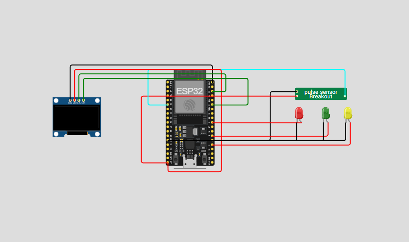

# 💓 Sistema de Monitoramento Cardíaco com ESP32

Este projeto tem como objetivo medir e exibir os batimentos cardíacos em tempo real usando o **ESP32 DevKit C V4**. O dispositivo apresenta informações no **OLED 128x64**, aciona LEDs de alerta e envia os dados via **MQTT**, permitindo acompanhamento remoto do ritmo cardíaco.

---

## ⚡ Recursos Principais

- Medição contínua do BPM a partir de sensor analógico.  
- LEDs indicadores do estado do batimento:  
  - 🟡 Pulso baixo  
  - 🟢 Pulso normal  
  - 🔴 Pulso alto  
- Exibição gráfica dos valores no **display OLED**.  
- Transmissão de dados em tempo real para broker **MQTT**.

---

## 🛠 Componentes Necessários

- ESP32 DevKit C V4  
- Sensor de pulso analógico (pino 35)  
- Display OLED 128x64 com interface I2C  
- LEDs coloridos (amarelo, verde e vermelho) com resistores  
- Conexão Wi-Fi estável  
- Broker MQTT público ou privado  

---

## 🚀 Instalação e Testes

1. Monte o circuito conforme o esquema do protótipo.  
2. Ajuste o **SSID** e senha da rede Wi-Fi, bem como o broker MQTT no código.  
3. Carregue o código no ESP32 usando Arduino IDE ou PlatformIO.  
4. Abra o monitor serial para conferir leituras do BPM e status do batimento.  
5. Observe os LEDs e o OLED atualizando os valores em tempo real.  

---

## 🔬 Testes Realizados

- Simulações com diferentes valores de pulso mostraram que os LEDs respondem corretamente.  
- O display OLED apresenta informações claras e atualizadas instantaneamente.  
- Publicações via MQTT foram verificadas usando **MQTT Explorer**, confirmando integridade dos dados.  
- Sistema apresentou estabilidade durante testes contínuos.  

---

## 💡 Possíveis Aperfeiçoamentos

- Criar interface web ou aplicativo para visualização remota e análise histórica.  
- Implementar notificações por smartphone quando o BPM sair da faixa ideal.  
- Adicionar armazenamento local ou na nuvem para histórico de leituras.  
- Integrar sensores adicionais para múltiplos usuários simultaneamente.  

---

## 📚 Referências

- F. Malan, *Getting Started with ESP32 Microcontrollers*, Maker Press, 2022.  
- Adafruit Learning System, *SSD1306 OLED Display Guide*, Adafruit, 2023.  
- HiveMQ, *Understanding MQTT Protocol*, HiveMQ Documentation, 2024.  
- P. Monk, *Programming Arduino: Getting Started with Sketches*, McGraw-Hill, 2021.
